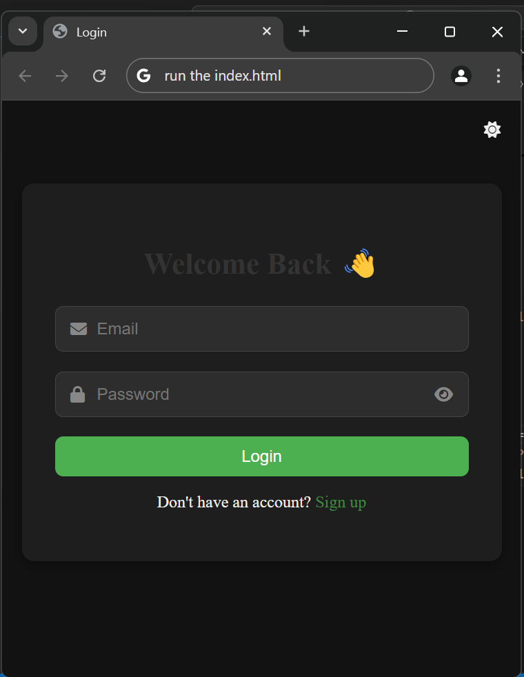
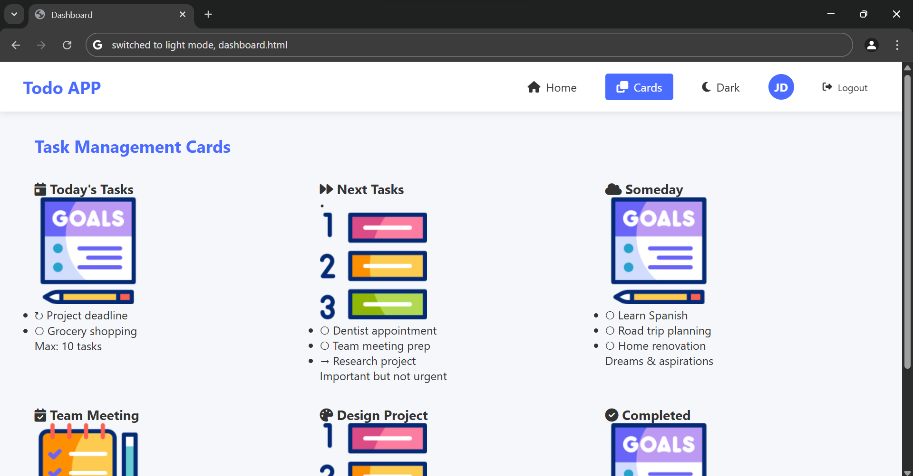
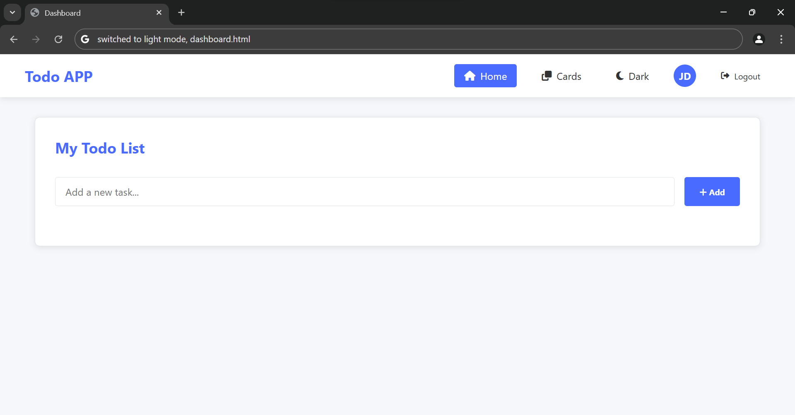

# 🌐 Web Development 

This is a simple responsive weekend web project.It demonstrates form validation, dynamic UI interactions, and responsive design principles using HTML, CSS, and JavaScript.

---

## 📌 Features Overview

### 🔐 Login Page
- Validates email format and password length (minimum 8 characters)
- Submit button disabled until both fields are valid
- Eye icon to show/hide password
- Dark mode to switch from light mode

### 📊 Dashboard
- Responsive top navigation menu with 2 links:
  - 🏠 Home (ToDo List)
  - 📄 Page 2 (Cards)
- Clean, modern layout with smooth transitions

### 📝 Home Page (ToDo List)
- Add, edit, and delete tasks (in-memory, no backend)
- Smooth animations for task entry and deletion
- Toast alerts for user feedback
- Fully responsive and user-friendly interface

### 📄 Page 2 (Responsive Cards)
- 3 text cards styled with hover effects and entry animation
- Category badges for visual flair
- Responsive layout:
  - 🖥 Desktop: 3 cards in a row
  - 📱 Tablet: 2 cards in a row, 1 below
  - 📱 Mobile: All stacked
- Dark mode toggle 🌙

---

## 🛠️ Technologies Used

- HTML5  
- CSS3 (Flexbox & Grid)  
- JavaScript (Vanilla)  
- Responsive Design Principles  
- Animations & Transitions  

---

## 📂 Folder Structure

```
/project-root
│
├── /icons               # Task-related icons
│   ├── goals.png
│   ├── task-list.png
│   └── to-do-list.png
│
├── /screenshots         # Preview images for README
│   ├── cards.png
│   ├── dashboard.png
│   ├── desktop.png
│   └── login.png
│
├── /scripts             # JavaScript files
│   ├── dashboard.js
│   └── script.js
│
├── /styles              # CSS stylesheets
│   ├── dashboard.css
│   └── style.css
│
├── dashboard.html       # Dashboard with responsive nav
├── index.html           # Login page
├── README.md            # Project overview (this file)
└── .gitattributes       # Git config

```

---

## 🚀 Getting Started

> No installations required. Just clone and run locally in your browser.

```bash
git clone https://github.com/brianmurunga/basic_design.git
cd basic_design
open index.html
```

---

## 📸 Preview

 

 

---

## 🙋‍♂️ Author

**[BMW]**  
🧑‍💻 Curious about UI/UX & clean frontend development  
 
🔗 [LinkedIn Profile](https://www.linkedin.com/in/brian-murunga-a0467a263/)  
🔗 [GitHub](https://github.com/brianmurunga)


Thanks for reviewing! 🙌
